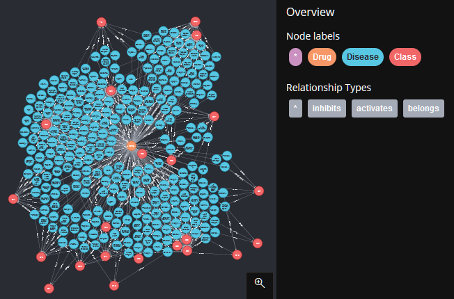

# Projeto `Interações entre Droga e Doença por meio de Genes`

# Equipe `Terror do SQL` - `TERR`

* `Mateus Siqueira Batista` - `241599`
* `Nicolas Bissoli Nattis` - `222903`

## Resumo do Projeto

Este projeto tem como objetivo estudar a relação entre drogas e doenças. Tal relação é dada por intermédio de genes em comum, ou seja, se uma droga A se relaciona com um gene Y, e este mesmo gene tem relação de causa com as doenças B e C, a droga A também tem relação com as doenças B e C. Para tal estudo, vamos utilizar 2 bases de dados: DGIDB (Banco de dados sobre interações droga-gene e o genoma drogável) e DisgeNet (pataforma contendo uma das maiores coleções publicamente disponíveis de genes e variantes associados a doenças humana).

## Slides da Apresentação

[Slides](slides/slides.pdf)

## Modelo Conceitual


## Modelos Lógicos

### Relacional

~~~
Drug(
    _Id_,
    _Name_,
)

Disease(
    _Id_,
    _Name_,
    Class,
)

Interaction(
    _InteractionId_,
    DrugId,
    DiseaseId,
    Score,
    Gene,
    Type,
)
            
Evidence(
    Pmid,
    Score,
)
~~~


### Grafo

> 


## Dataset Publicado

título do arquivo/base | link | breve descrição
----- | ----- | -----
tsv | [tsv](data/processed/tsv) | Arquivos tabulares em formato TSV.
sqlite | [sqlite](data/processed/sqlite) | Database SQLite.
neo4j | [neo4j](data/processed/neo4j) | Arquivos CSV para importar em Neo4j.

## Bases de Dados

título da base | link | breve descrição
----- | ----- | -----
DisgeNET | [Link](https://www.disgenet.org/) | Plataforma contendo uma das maiores coleções publicamente disponíveis de genes e variantes associados a doenças humanas.
DGIDB | [Link](https://www.dgidb.org/ )| O DGIDB possui dados extraídos de mais de trinta fontes confiáveis sobre interações droga-gene e o genoma drogável.

## Detalhamento do Projeto

Primeiramente, transformamos o SQLite do Disgenet em dados tsv em
[disgenet2tsv.py](src/disgenet2tsv.py).

```python
    # Importação das iterações

    print('Generating interactions')
    with open('../data/external/disgenet/interactions.tsv', 'w') as f:
        f.write('DiseaseId\tGene\tScore\tPMID\tType\n')
        for (number, gene) in enumerate(genes):
            print(f'\r{(number + 1) * 100 // len(genes)} % ({number + 1} / {len(genes)})', end='')
            for disease, type, pmid, score in conn.execute(
                'SELECT d.diseaseNID, d.associationType, d.pmid, d.score'
                    + ' FROM geneDiseaseNetwork AS d, geneAttributes as g'
                    + ' WHERE g.geneName = ? AND g.geneNID = d.geneNID', [gene]):
                f.write(f'{diseases_id[disease]}\t{gene}\t{score}\t{pmid}\t{type}\n')
```

Depois, usamos estes dados TSV com o TSV do DGIDB para gerar os dados TSV finais.

```python
# Parse de dados do DGIDB

def parse() -> Dgidb:
    r = Dgidb()

    dgidb = pd.read_csv(
        '../data/external/dgidb/interactions.tsv',
        sep='\t',
        encoding='utf-8')
    dgidb = dgidb.dropna()
    scaler = MinMaxScaler()
    dgidb[['interaction_group_score']] = scaler.fit_transform(
        dgidb[['interaction_group_score']])

    for _, row in dgidb.iterrows():
        drug = row['drug_concept_id']
        gene = row['gene_name']
        drug_name = row['drug_name']
        pmids = str(row['PMIDs']).split(',')
        score = row['interaction_group_score']

        types = str(row['interaction_types']).split(',')
        ty = None
        for x in types:
            try:
                y = dgidb_interaction_types[x]
                if ty == None or ty == y:
                    ty = y
                else:
                    ty = None
                    break
            except KeyError:
                pass
        if ty == None:
            continue
        r.drug_names[drug] = drug_name
        r.interactions[gene].append(
            DrugGeneInteraction(drug, ty, score, pmids))

    return r
```

Neste passo realizamos as operações para gerar o score.

Para o DGIDB fazemos uma média dos scores, e então multiplicamos com o
score total do Disgenet para cada tripla drug-gen-disease.

Finalmente, transformamos os dados TSV em SQLite em [tsv2sqlite.py](src/tsv2sqite.py)
ou CSV para o Neo4j em [tsv2neo4j.py](src/tsv2neo4j.py) para a publicação nos
formatos.

```python
# Geração de nós

print('Generating nodes.csv')
with open('../data/processed/neo4j/nodes.csv', 'w', newline='') as fout:
    out = csv.writer(fout)
    out.writerow(['id:ID', 'name', ':LABEL'])

    with gzip.open('../data/processed/tsv/drugs.tsv.gz', 'rt') as f:
        dict = csv.DictReader(f, delimiter='\t')
        out.writerows([[row['Id'], row['Name'], 'Drug'] for row in dict])

    with gzip.open('../data/processed/tsv/diseases.tsv.gz', 'rt') as f:
        dict = csv.DictReader(f, delimiter='\t')
        for row in dict:
            out.writerow([row['Id'], row['Name'], 'Disease'])
            for class_ in row['Class'].split(';'):
                disease_classes[class_].append(row['Id'])
    
    out.writerows([[x, x, 'Class'] for x in disease_classes])
```

## Evolução do Projeto

Diante do desafio de encontrar a relação entre Drogas/Fármacos e Doenças, tivemos como principal desafio lidar com uma grande quantidade de dados;
Nossa primeira tentaiva de extração de dados das fontes foi através das APIs disponibilizadas pelas plataformas. Todavia, tanto o DisgeNET como o DGIDB contam com uma quantidade muito grande de registros em seus bancos de dados. Desse modo, as requisições HTTP feitas nas APIs acabavam ficando muito lentas. Para resolver tal problema tivemos duas opções: utilizar metodos assíncronos no python para aumentar o numero de requisições sendo feitas ao mesmo tempo, ou baixar diretamente os dados das plataformas (tipos TSV ou SQLite). Optamos pela segunda opção, que para o DisgeNET só foi possível no formato SQLite, pois o arquivo .TSV disponibilizado para download carecia de alguns dados necessários, como o Score.

Ademais, outro desafio encontrado foi a necessidade de classificar a confiabilidade de uma interação Droga/Doença;
Nesse sentido, os dados coletados possuem níveis de confiabilidade variáveis, que foram levados em conta e tranformados em um Score. Todavia, nos dados (antes do processamento) havia um Score atrelado ao DgIdb (Score que qualificava a interação Droga/Gene) e outro ao DisGeNET (Score que qualificava a interação Doença/Gene). Assim, obtivemos um Score global da interação multiplicando um pelo outro.

Alem disso, tivemos um problema relacionado aos tipos de interação Droga/Doença. No caso do DisgeNET, tinhamos 8 tipos de interação, e no caso do DGIDB tinhamos 18 tipos diferentes. Desse modo, precisamos classificar todas esses tipos de interação em apenas 2: ativação e inibição, como podemos ver na imagem abaixo.


Nossos modelos lógicos também evoluiram ao longo do processo. Nesse sentido, inicialmente tinhamos o seguinte modelo

~~~~
Drug(__DrugId__, Name, Class)
DrugAlias(__DrugAlias__, __DrugId__)

Disease(__DiseaseId__, Name)
DiseaseAlias(__DiseaseAlias__, DiseaseId)

Interaction(__InteractionId__,
               DrugId,
               DiseaseId,
               InteractionType)

InteractionSrc(InteractionId,
              TrustLevel,
              Gene,
              GeneDrugInteraction,
              GeneDrugInteractionMechanism,
              DrugDiseaseInteraction,
              Source)
~~~~

Este evoluiu para a a adiçao da entidade "Evidencia", que passa a qualificar uma interação. Além disso, como podemos ver no modelo apresentado anteriormente no trabalho, alguns campos foram adicionados, como o Score da Interação.

## Perguntas de Pesquisa/Análise Combinadas e Respectivas Análises

### Perguntas/Análise com Resposta Implementada

#### Pergunta/Análise 1

* Selecione o nome das drogas e doenças das N interações com maior pontuação.

   * Usando o SQL com 10 interações:

```sql
SELECT Dr.Name, Di.Name, I.Type, I.Score FROM Interaction as I, Drug as Dr, Disease  as Di WHERE Dr.Id = I.DrugId AND Di.Id = I.DiseaseId ORDER BY I.Score DESC LIMIT 10;
```

Resultado:

| `Dr.Name` | `Di.Name` | `I.Type` | `I.Score` |
|-----------|-----------|----------|-----------|
|NITISINONE|Tyrosinemia, Type III|0|0.861673561599624|
|BUROSUMAB|Autosomal dominant hypophosphatemic rickets|0|0.833348003403456|
|NITISINONE|Hawkinsinuria|0|0.669172021242262|
|THIAMINE|THIAMINE METABOLISM DYSFUNCTION SYNDROME 5 (EPISODIC ENCEPHALOPATHY TYPE)|1|0.591677082416454|
|BUROSUMAB|TUMORAL CALCINOSIS, HYPERPHOSPHATEMIC, FAMILIAL, 1|0|0.500008802042074|
|BUROSUMAB|TUMORAL CALCINOSIS, HYPERPHOSPHATEMIC, FAMILIAL, 2|0|0.500008802042074|
|BUROSUMAB|Hypophosphatemic Rickets|0|0.416674001701728|
|BUROSUMAB|TUMORAL CALCINOSIS, HYPERPHOSPHATEMIC, FAMILIAL|0|0.416674001701728|
|NITISINONE|Tyrosinemias|0|0.40333656074876|
|GLEMBATUMUMAB VEDOTIN|AMYLOIDOSIS, PRIMARY LOCALIZED CUTANEOUS, 3|1|0.4|

#### Pergunta/Análise 2

* Quais drogas tem relação com a doença (Acute lymphocytic leukemia) C0023449?
   
    * Vamos selecionar os 10 primeiros registros com a seguinte query:
```sql
SELECT Dr.Id, Dr.Name, I.Type, I.Score FROM INTERACTION as I, DRUG as Dr, Disease as Di WHERE Di.id ='C0023449' AND I.DiseaseId = Di.id ORDER BY I.Score DESC LIMIT 10;
```
   Resultado:
   
| `Dr.Id` | `Dr.Name` | `I.Type` | `I.Score` |
|-----------|-----------|----------|-----------|
chembl:CHEMBL398707|HYDROMORPHONE|0|0.0388903558959012
chembl:CHEMBL3545253|FLORTAUCIPIR F 18|0|0.0388903558959012
chembl:CHEMBL2|PRAZOSIN|0|0.0388903558959012
chembl:CHEMBL1621597|IPRATROPIUM|0|0.0388903558959012
chembl:CHEMBL157101|KETOCONAZOLE|0|0.0388903558959012
chembl:CHEMBL1670|MITOTANE|0|0.0388903558959012
chembl:CHEMBL723|CARVEDILOL|0|0.0388903558959012
chembl:CHEMBL157138|LISURIDE|0|0.0388903558959012
chembl:CHEMBL2103830|FOSTAMATINIB|0|0.0388903558959012
chembl:CHEMBL1201250|BENZQUINAMIDE|0|0.0388903558959012

### Perguntas/Análise com Resposta Não Implementada

#### Pergunta/Análise 3

* Quais classes de doenças são mais ativadas pela HYDROMORPHONE?

   * Esta pergunta necessita de uma análise de grafo aprofundada. Podemos começar a partir da query no Neo4j.

```
MATCH (dr:Drug)-[activates]->(di:Disease)-[belongs]->(c:Class) WHERE dr.name='HYDROMORPHONE' RETURN dr, activates, di, belongs, c
```



#### Pergunta/Análise 4

* É possível deduzir novas interações a partir das interações do dataset?

   * Análise por predição de link.

#### Pergunta/Análise 5

* Podemos identificar tipos de drogas e doenças que interagem mais fortemente
  entre si?

    * Análise por comunidade/modularidade.
