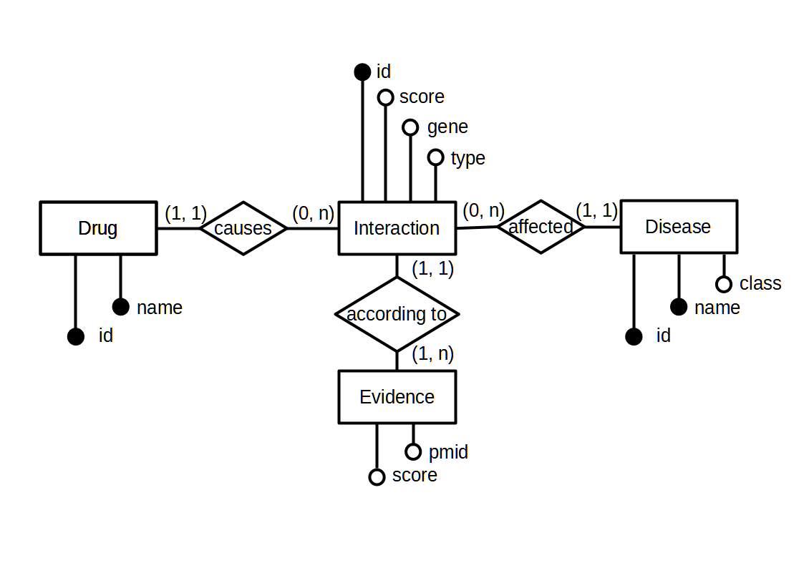
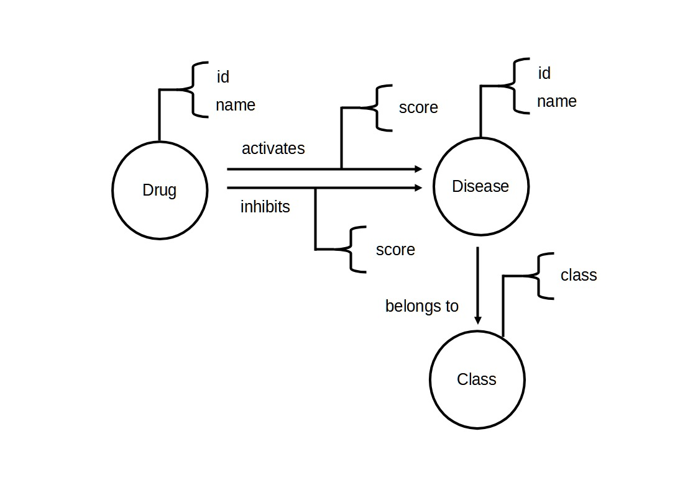
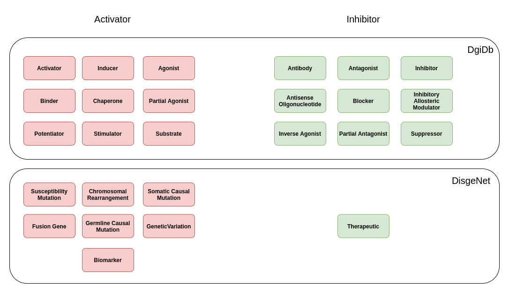

# Projeto `Interações entre Droga e Doença por meio de Genes`

# Equipe `Terror do SQL` - `TERR`

* `Mateus Siqueira Batista` - `241599`
* `Nicolas Bissoli Nattis` - `222903`

## Resumo do Projeto

Este projeto tem como objetivo estudar a relação entre drogas e doenças. Tal relação é dada por intermédio de genes em comum, ou seja, se uma droga A se relaciona com um gene Y, e este mesmo gene tem relação de causa com as doenças B e C, a droga A também tem relação com as doenças B e C. Para tal estudo, vamos utilizar 2 bases de dados: DGIDB (Banco de dados sobre interações droga-gene e o genoma drogável) e DisgeNet (pataforma contendo uma das maiores coleções publicamente disponíveis de genes e variantes associados a doenças humana).

## Slides da Apresentação

[Slides](slides/slides.pdf)

## Modelo Conceitual



## Modelos Lógicos

### Relacional

~~~
Drug(
    _Id_,
    _Name_,
)

Disease(
    _Id_,
    _Name_,
    Class,
)

Interaction(
    _InteractionId_,
    DrugId,
    DiseaseId,
    Score,
    Gene,
    Type,
)
            
Evidence(
    Pmid,
    Score,
)
~~~


### Grafo

> 


## Dataset Publicado

título do arquivo/base | link | breve descrição
----- | ----- | -----
tsv | [tsv](data/processed/tsv) | Arquivos tabulares em formato TSV.
sqlite | [sqlite](data/processed/sqlite) | Database SQLite.
neo4j | [neo4j](data/processed/neo4j) | Arquivos CSV para importar em Neo4j.

## Bases de Dados

título da base | link | breve descrição
----- | ----- | -----
DisgeNET | [Link](https://www.disgenet.org/) | Plataforma contendo uma das maiores coleções publicamente disponíveis de genes e variantes associados a doenças humanas.
DGIDB | [Link](https://www.dgidb.org/ )| O DGIDB possui dados extraídos de mais de trinta fontes confiáveis sobre interações droga-gene e o genoma drogável.

## Detalhamento do Projeto

> Apresente aqui detalhes do processo de construção do dataset e análise. Nesta seção ou na seção de Perguntas podem aparecer destaques de código como indicado a seguir. Note que foi usada uma técnica de highlight de código, que envolve colocar o nome da linguagem na abertura de um trecho com `~~~`, tal como `~~~python`.
> Os destaques de código devem ser trechos pequenos de poucas linhas, que estejam diretamente ligados a alguma explicação. Não utilize trechos extensos de código. Se algum código funcionar online (tal como um Jupyter Notebook), aqui pode haver links. No caso do Jupyter, preferencialmente para o Binder abrindo diretamente o notebook em questão.


~~~python
df = pd.read_excel("/content/drive/My Drive/Colab Notebooks/dataset.xlsx");
sns.set(color_codes=True);
sns.distplot(df.Hemoglobin);
plt.show();
~~~

> Se usar Orange para alguma análise, você pode apresentar uma captura do workflow, como o exemplo a seguir e descrevê-lo:


> Coloque um link para o arquivo do notebook, programas ou workflows que executam as operações que você apresentar.

> Aqui devem ser apresentadas as operações de construção do dataset:
* extração de dados de fontes não estruturadas como, por exemplo, páginas Web
* agregação de dados fragmentados obtidos a partir de API
* integração de dados de múltiplas fontes
* tratamento de dados
* transformação de dados para facilitar análise e pesquisa

> Se for notebook, ele estará dentro da pasta `notebook`. Se por alguma razão o código não for executável no Jupyter, coloque na pasta `src` (por exemplo, arquivos do Orange ou Cytoscape). Se as operações envolverem queries executadas atraves de uma interface de um SGBD não executável no Jupyter, como o Cypher, apresente na forma de markdown.

## Evolução do Projeto

Diante do desafio de encontrar a relação entre Drogas/Fármacos e Doenças, tivemos como principal desafio lidar com uma grande quantidade de dados;
Nossa primeira tentaiva de extração de dados das fontes foi através das APIs disponibilizadas pelas plataformas. Todavia, tanto o DisgeNET como o DGIDB contam com uma quantidade muito grande de registros em seus bancos de dados. Desse modo, as requisições HTTP feitas nas APIs acabavam ficando muito lentas. Para resolver tal problema tivemos duas opções: utilizar metodos assíncronos no python para aumentar o numero de requisições sendo feitas ao mesmo tempo, ou baixar diretamente os dados das plataformas (tipos TSV ou SQLite). Optamos pela segunda opção, que para o DisgeNET só foi possível no formato SQLite, pois o arquivo .TSV disponibilizado para download carecia de alguns dados necessários, como o Score.

Ademais, outro desafio encontrado foi a necessidade de classificar a confiabilidade de uma interação Droga/Doença;
Nesse sentido, os dados coletados possuem níveis de confiabilidade variáveis, que foram levados em conta e tranformados em um Score. Todavia, nos dados (antes do processamento) havia um Score atrelado ao DgIdb (Score que qualificava a interação Droga/Gene) e outro ao DisGeNET (Score que qualificava a interação Doença/Gene). Assim, obtivemos um Score global da interação multiplicando um pelo outro.

Alem disso, tivemos um problema relacionado aos tipos de interação Droga/Doença. No caso do DisgeNET, tinhamos 8 tipos de interação, e no caso do DGIDB tinhamos 18 tipos diferentes. Desse modo, precisamos classificar todas esses tipos de interação em apenas 2: ativação e inibição, como podemos ver na imagem abaixo.



Nossos modelos lógicos também evoluiram ao longo do processo. Nesse sentido, inicialmente tinhamos o seguinte modelo

~~~~
Drug(__DrugId__, Name, Class)
DrugAlias(__DrugAlias__, __DrugId__)

Disease(__DiseaseId__, Name)
DiseaseAlias(__DiseaseAlias__, DiseaseId)

Interaction(__InteractionId__,
               DrugId,
               DiseaseId,
               InteractionType)

InteractionSrc(InteractionId,
              TrustLevel,
              Gene,
              GeneDrugInteraction,
              GeneDrugInteractionMechanism,
              DrugDiseaseInteraction,
              Source)
~~~~

Este evoluiu para a a adiçao da entidade "Evidencia", que passa a qualificar uma interação. Além disso, como podemos ver no modelo apresentado anteriormente no trabalho, alguns campos foram adicionados, como o Score da Interação.

## Perguntas de Pesquisa/Análise Combinadas e Respectivas Análises

### Perguntas/Análise com Resposta Implementada

#### Pergunta/Análise 1

* Selecione o nome das drogas e doenças das N interações com maior pontuação.

   * Usando o SQL com 10 interações:

```sql
SELECT Dr.Name, Di.Name, I.Type, I.Score FROM Interaction as I, Drug as Dr, Disease  as Di WHERE Dr.Id = I.DrugId AND Di.Id = I.DiseaseId ORDER BY I.Score DESC LIMIT 10;
```

Resultado:

| `Dr.Name` | `Di.Name` | `I.Type` | `I.Score` |
|-----------|-----------|----------|-----------|
|NITISINONE|Tyrosinemia, Type III|0|0.861673561599624|
|BUROSUMAB|Autosomal dominant hypophosphatemic rickets|0|0.33348003403456|
|NITISINONE|Hawkinsinuria|0|0.669172021242262|
|BUROSUMAB|Hypophosphatemic Rickets|0|0.416674001701728|
|BUROSUMAB|TUMORAL CALCINOSIS, HYPERPHOSPHATEMIC, FAMILIAL|0|0.16674001701728|
|NITISINONE|Tyrosinemias|0|0.40333656074876|
|GOLODIRSEN|Muscular Dystrophy, Duchenne|1|0.388903558959012|
|GLEMBATUMUMAB VEDOTIN|Malignant neoplasm of breast|1|0.386666666666667|
|UROFOLLITROPIN|Ovarian Hyperstimulation Syndrome|1|0.346659625033008|
|THIAMINE|Dystonia|1|0.333339201361383|

#### Pergunta/Análise 2

* Quais drogas tem relação com a doença (Acute lymphocytic leukemia) C0023449 ?
   
    * Vamos selecionar os 10 primeiros registros com a seguinte query:
```sql
SELECT D.Id, D.Name  FROM INTERACTION as I, DRUG as D, Disease  as Di  WHERE Di.id ='C0023449'  LIMIT 10;
```
   Resultado:
   
| `Drug Id` | `Drug Name`  |
|-----------|-----------|
chembl:CHEMBL398707|HYDROMORPHONE
chembl:CHEMBL3545253|FLORTAUCIPIR F 18
chembl:CHEMBL2|PRAZOSIN
chembl:CHEMBL1621597|IPRATROPIUM
chembl:CHEMBL157101|KETOCONAZOLE
chembl:CHEMBL1670|MITOTANE
chembl:CHEMBL723|CARVEDILOL
chembl:CHEMBL157138|LISURIDE
chembl:CHEMBL2103830|FOSTAMATINIB
chembl:CHEMBL1201250|BENZQUINAMIDE

#### Pergunta/Análise 3
* Quais Classes de Doenças estão mais relacionadas com a Droga Y?

   * Explicação sucinta da análise que será feita e conjunto de queries que
     responde à pergunta.
