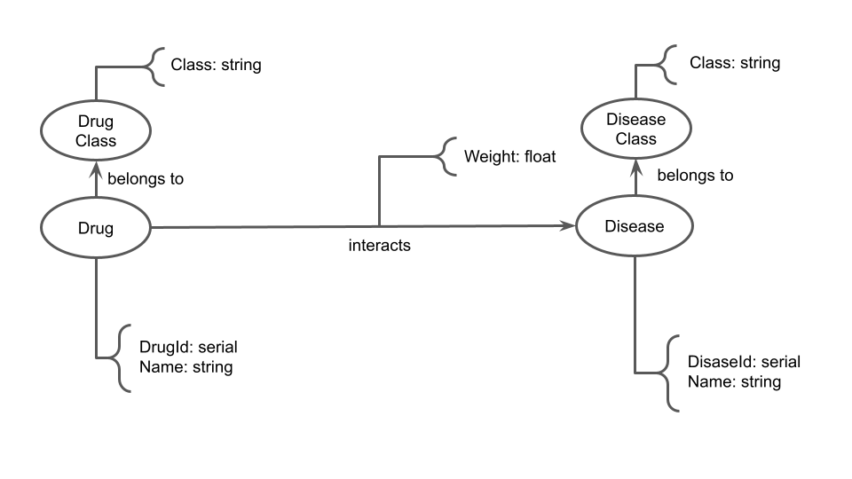

# Equipe `Terror do SQL` - `TERR`

* `Mateus Siqueira Batista` - `241599`
* `Nicolas Bissoli Nattis` - `222903`

## Modelo Lógico Combinado do Banco de Dados de Grafos

Pode ser realizada uma transformação no grafo de forma que selecionaremos pares droga-doença que são regidos conforme interações e ligaremos os vértices por uma aresta com peso ligado a confiabilidade das fontes dessa interação, de forma que se a interação for de causa o peso é positivo e se for de inibição é negativo, e um valor mais próximo de zero indica uma interação menos confiável.

Em outras palavras, realizamos uma projeção de drogas e doenças e os vértices são gerados a partir de uma função que recebe as interações.

Também faremos projeção das classes em nós próprios.

Modelo gerado pela transformação:

## Perguntas de Pesquisa/Análise Combinadas e Respectivas Análises

### Pergunta/Análise 1

* Qual grupo de drogas tem relação com a doença X?

  * Selecionamos apenas a doença X e as drogas e suas classes relacianadas com X. A partir disso, utilizaremos Centralidade de Proximidade para identificar qual grupo de droga tem interação mais forte com a doença X (quais grupos de drogas está mais próximo de X).

### Pergunta/Análise 2

* Qual a principal classe de doenças relacionada à droga Y?

  * Explicação sucinta da análise que será feita no grafo para atender à pergunta. Deve ser indicado explicitamente em qual das modalidades a análise se encaixa: centralidade; vulnerabilidade; comunidade/modularidade; motifs; predição de links.

### Pergunta/Análise 3

* Quais interações entre doença e droga são prováveis com base em interações registradas no banco de dados?

  * Projetamos apenas as drogas e doenças da rede. A partir dos links criados é possível fazer uma predição de links para encontrar possíveis interações não registradas entre droga e doença a partir de outras interações com drogas e doenças com comportamento similar dentro da rede gerada.
