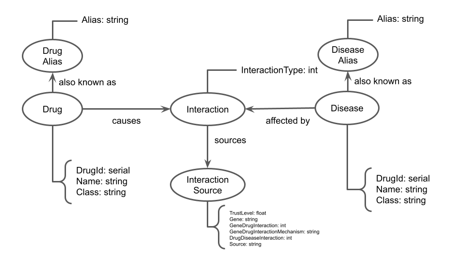

# Equipe `Terror do SQL` - `TERR`

* `Mateus Siqueira Batista` - `241599`
* `Nicolas Bissoli Nattis` - `222903`

## Modelo Lógico Combinado do Banco de Dados de Grafos

## Perguntas de Pesquisa/Análise Combinadas e Respectivas Análises

### Pergunta/Análise 1

* Qual grupo de drogas tem relação com a doença X?

  * Explicação sucinta da análise que será feita no grafo para atender à pergunta. Deve ser indicado explicitamente em qual das modalidades a análise se encaixa: centralidade; vulnerabilidade; comunidade/modularidade; motifs; predição de links.

### Pergunta/Análise 2

* Qual a principal classe de doenças relacionada à droga Y?

  * Explicação sucinta da análise que será feita no grafo para atender à pergunta. Deve ser indicado explicitamente em qual das modalidades a análise se encaixa: centralidade; vulnerabilidade; comunidade/modularidade; motifs; predição de links.

### Pergunta/Análise 3

* Quais interações entre doença e droga são prováveis com base em interações registradas no banco de dados?

  * Explicação sucinta da análise que será feita no grafo para atender à pergunta. Deve ser indicado explicitamente em qual das modalidades a análise se encaixa: centralidade; vulnerabilidade; comunidade/modularidade; motifs; predição de links.
